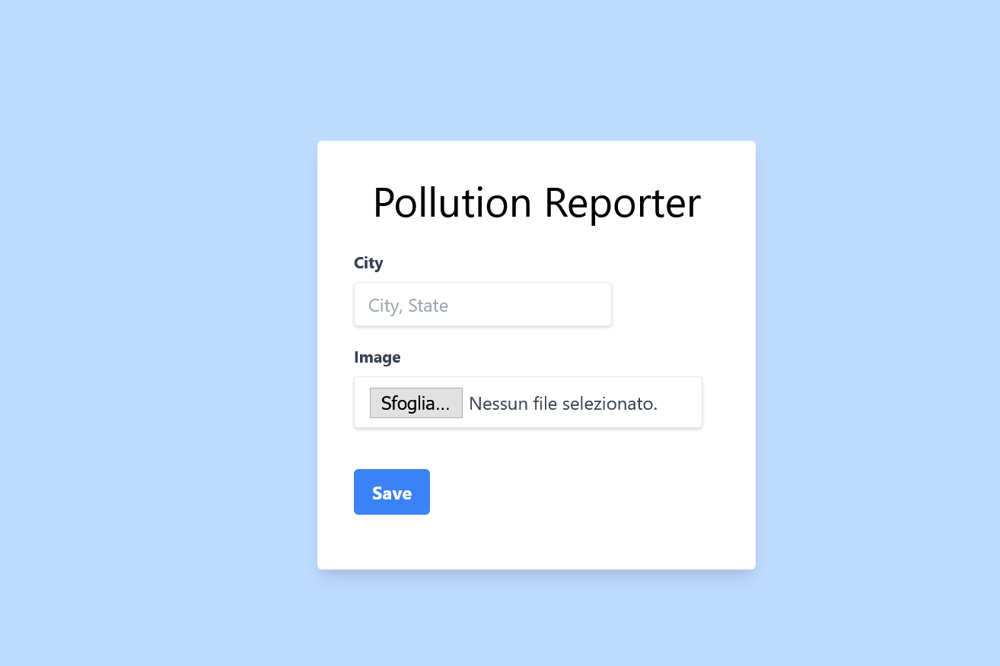

## Pollution Reporter
Project made for star2Impact nodejs super guide. 

Requirements: 
- You will be able to provide the application with a graphical interface, or you will be able to implement only the API, this at your complete discretion;
- In order to use it, you will need to make available the upload of photos certifying the environmental pollution taking place, and the address/location of the same;
- The application will then have to provide an endpoint to display the list of all the reported places.


**Build with**
- NodeJs
- ExpressJs



## Getting Started
1. Clone the repo 
2. Setup a mySql DB
3. Import the project migration file `pollution_report.sql`
4. Create a `.env` file and fill it with you DB data 
```
DB_HOST=YOUR_HOST
DB_USER=YOUR_USERNAME
DB_PASSWORD=YOUR_PASSWORD
DB_NAME=YOUR_DB_NAME`
RUNNING_PORT=RUNNING_PORT
```
5.  Install project dependencies

```node
npm install
```

6.  Start the server 
```node
npm start
``` 

## Usage 
To access the submit form go the following url
``` url
http://localhost:3000/pollution
```

I created only one endpoint where user can see all the reports: 
```url
http://localhost:3000/pollution/all
````

